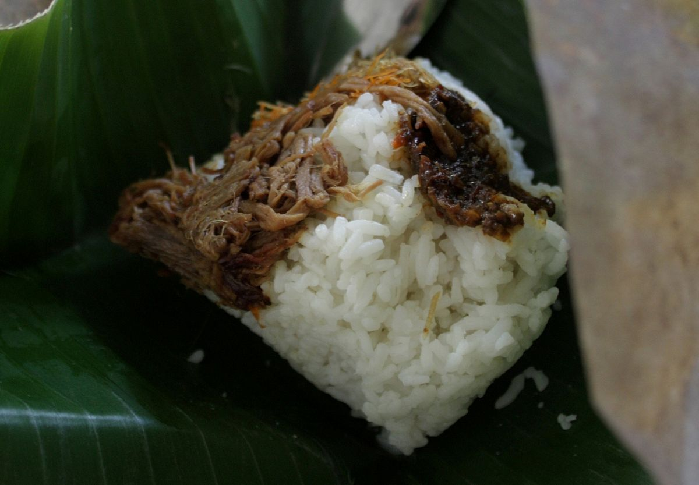

# Nasi Krawu

## Description

Nasi krawu merupakan makanan khas dari daerah Gresik, Jawa Timur. Cirinya adalah nasinya yang pulen dan disajikan dengan daun pisang. Lauknya dapat berupa sayatan daging sapi, semur daging, jeroan sapi, sambal petis dan serundeng. Sambal terasi yang disajikan bersama dengan nasi krawu memiliki rasa pedas yang khas. Bagi pecinta masakan pedas, wajib mencoba nasi krawu saat berkunjung ke Gresik.

## Sources
[Wikipedia](https://id.wikipedia.org/wiki/Nasi_krawu)
